Gracias a Simple Time Tracker:

```mermaid
gantt
    title 24 de enero de 2024
    dateFormat  HH:mm
    axisFormat %H:%M
    
    Dormir                  :   00:00, 08:00
    Desayuno                :   08:15, 08:30
    Ducha                   :   08:30, 08:50
    Ejercicio               :   09:00, 09:30
    Estudio                 :   10:00, 12:00
    Comida                  :   13:00, 13:15
    Clases                  :   13:30, 15:30
    42Madrid                :   16:30, 20:30
    Cena                    :   21:00, 21:20
    Videollamada con Marta  :   21:30, 22:30
    Escribir diario         :   22:30, 23:00
```

Mi partida diaria en chess.com:

<iframe id="11443449" allowtransparency="true" frameborder="0" style="width:100%;border:none;" src="//www.chess.com/emboard?id=11443449"></iframe>

Mi canción favorita del día:

<iframe style="border-radius:12px" src="https://open.spotify.com/embed/track/09Y3MAXfzUEFcQdbZUurEM?utm_source=generator" width="100%" height="352" frameBorder="0" allowfullscreen="" allow="autoplay; clipboard-write; encrypted-media; fullscreen; picture-in-picture" loading="lazy"></iframe>
